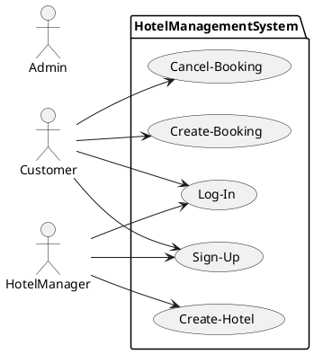
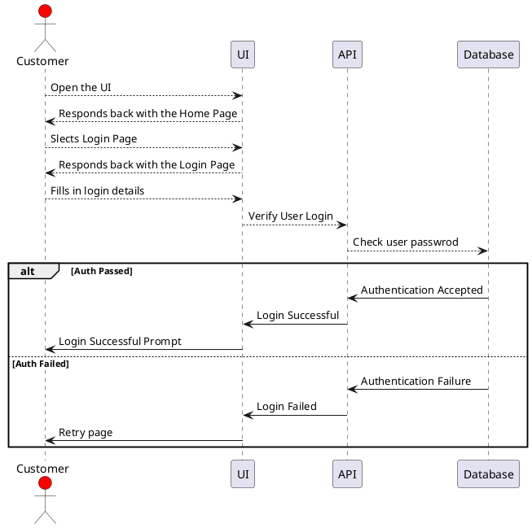
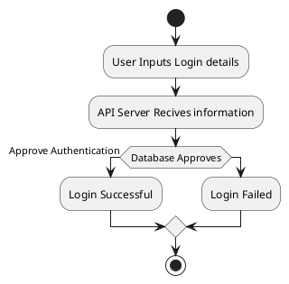

> **Breif:**
>
> This is a sample document demonstrating how you can go about documenting your Projects using the tools mentioned below.
>
> For reference on how to write markdowns, please Google and read up on
>  * Markdown Files - Helps create documents for your Projects and various componets in it
>  * PlantUML - Helps define your Software Projects - High Level and Low level Design Documents, and also Wireframes for your UI representation
>
> This is a sample markdown file that can be rendered and viewed in Visual Code or any other IDE that supports Markdown Files and PlantUML Extensions.
> For visual studio code you need to download Markdownlint and PlantUML Extensions. You also might need to additionally configure a PlantUML Server for your extension,
> the details to which can be again found on Google :)

# Hotel Management Web Service

## **A. Content**

`<<This is where you list our all the Headings in your document.>>`

## **1. High Level Description**

`<<This is where you should decribe the problem statement you are trying to solve with your project.>>`

`<<You should Identify the following parameter when writing this part of your document :`
* `1. What is the Problem my project is trying to solve ? [Crisp defination of the Problem Statement]`
* `2. Why do I want to solve this problem [Uniqueness of the Solution] ?`
* `3. How will my solution benifit me and the users of my system ? `

` Answer the above questions in a breif manner>>`

`<<Additionally, list down the features that you think should be supported by your solution to be a minimum viable product>>`

``<< Below is a sample that lists some features for a minimum>>``

We are implementing a Web Service that will allow a user to :

  * Login Page - 
    * Customer
    * Admin
    * Hotel Managers
  * Sign Up -
    * Customer
    * Admin
    * Hotel Managers
  * Listing of Available Hotels 
    * Basic Listing of available hotels on a given day
    * Availability of Quarantine Center
    * Availabilty of Monitoring System
  * Booking of Hotels
    ``<<List down further as done above>>``

## **2. Technologies Used and Local Setup Details**

``<<Define the Technologies you have used to implement your solution>>``

``<<For Web Based Applications, define your API Endpoints and what each endpoint is responsible for in your application's scope. Also in your design docs please add UI Wireframes to explain the different pages that your UI Application needs to support.>>``

``<<For AI/ML Models, you can also explain how your Model works in realtime, its feature set, its various training capabilities and how you fine tune its prediction capanbilities>>``

``<<For a Hardware Based Project, please define the Micro-Controller, Senors and other Programmable Logical Modules that you have used to perform some monitoring activity for Temperature, Pressure etc and how you have integrated the various components together. You should also give a breif of the Controller used and its capabilities and a breif overview of what it does>>``


## **3. Design Docs and Diagrams**

``<<For AI/ML projects, like the one you guys are working on, you can have the different decision trees that are generated basis the features that you select, as different daigrams and explain here how selection of feature leads to change in outcome of prediction accuracy for your model. You can also have the flow daigram of how your model trains internally. Or how it converts real time data to predict the outcome using interactive flow daigrams and graphs. >>``

``<<For your micro-controller based projects in addition to maybe dome design docs if needed for reference on how to program your logical controller, you can have circuit daigrams explaining how the circuitry would work and also some PIN daigrams for the different micro-contorllers used.>>``

``<<For general Software Engineering projects, its a suggestion to create Design Docs for atleast : >>``

* ``<<1. Use Case Diagram : Defines all the Use-Cases that the system can define for its Users >>``
* ``<<2. Component Diagram : Defines all the components involved in the System >>``
* ``<<3. Sequence Diagram : Defines all the Req-Resp Events for different Components of the System. Can also define Req-Resp between different Software Systems.>>``
* ``<<4. Activity Diagram : Defines a process flow for any activity within the system>>``

``<<Below are defined some daigrams for your reference using PlantUML >>``

### **3.1. Use Case Diagram**

* List of Users
  * Customer
  * Admin
  * Hotel Manager

* Use-Cases
  * Customer can Sign Up
  * Hotel Manager can Sign Up
  * Customer can make a booking
  * Customer can cancel a booking
  * Customer can update a booking
  * Hotel manager can updgrade a booking



### **3.2 Sequence Daigram**

#### 3.2.1 Sequence Daigram for Log-In for a Customer User



### **3.3 Activity Daigram**

#### 3.3.1 Activity Daigram for User Login



### **3.4 Component Daigram**

```plantuml
component as [Hotel-Mangement-UI]
component as [Hotel-Mangement-API]
```

## **4. User Journeys**

``<<These are summary of different user scenarios that are possible for your System and are define as Furture or Current Requirements For your applications. You can derive a list of features that would allow you to support functionalities that you have proposed >>``

``<<Eg User Journey>>``

A User, who is a normal customer for the Hotel Management system that we are creating should be allowed to create a unique session upon Login. If a customer does not have an account on the system, then he should be allowed to sign up with his own unique email id which has used for registration previously. He should add the details requested along with a valid 10 digit mobile number and a password that is Alphanumeric and contains atleast 8 letters, a special character and 3 digits. 

``<<Above sentences describes a set of requirements for Password, creation of user accounts and basics of how the system should handle the above things at a very high level. This will serve as an initial requiremnt to you, which you can refine furthur, by asking questions to your client or in this case, your teachers or peers as to how this statement can be improved furthur to define fully the features needed for the system functionalities.>>``
